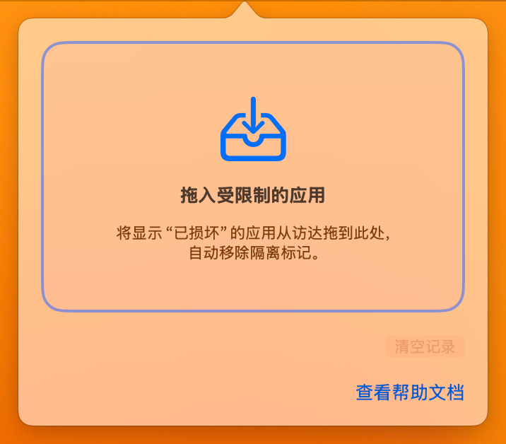

# Unseal

Unseal 是一款 Swift/SwiftUI 编写的 macOS 菜单栏小工具，专为“应用已损坏，无法打开”提示设计。用户只需从访达拖入受限的 `.app` 包，工具会仅移除 `com.apple.quarantine` 隔离标记并重新校验 Gatekeeper，结果即时反馈。

## 界面预览


## 功能亮点
- **菜单栏常驻**：点击图标即可呼出拖拽面板，界面简洁清晰。
- **登录自动启动**：默认关闭，可在面板或设置中按需开启；正式签名包优先使用系统登录项，本地构建回退到 LaunchAgent。
- **拖拽修复**：支持从访达拖入单个 `.app` 包触发修复；一次拖入多个应用时会明确提示并拒绝。
- **诊断说明**：失败时展示执行命令及系统反馈，附带重试与操作建议。
- **状态重置**：一键清空修复记录，恢复初始拖拽提示。
- **零监听**：不后台扫描磁盘，仅在用户操作时运行命令，无额外数据收集。

## 快速开始
```bash
swift run
```

`swift run` 适合开发调试，但不会生成完整 `.app`，因此登录启动不可用。需要常驻使用时，请按下文打包；本地/ad-hoc 构建会在 `SMAppService` 不可用时自动使用用户级 LaunchAgent。

## 打包脚本

仓库根目录提供两套辅助脚本，简化图标生成与通用应用打包流程：

1. **生成 macOS 图标**  
   在 `icon/`、`icons/macos/` 或自定义目录（可通过脚本参数指定）放置至少 `1024.png`，可选放入 `16.png`、`32.png` 等尺寸。执行：
   ```bash
   ./generate_app_icon.sh [图标目录，可选]
   ```
   脚本会使用 `sips` 与 `iconutil` 输出 `Sources/AppModule/Resources/AppIcon.icns`，并自动补全缺失尺寸。

2. **构建并打包双架构应用**  
   ```bash
   ./package_app.sh
   ```
   - 自动清理 `.build` 缓存；
   - 直接交叉构建 `arm64` 与 `x86_64` 版本，无需 Rosetta；
   - 利用 `lipo` 合并通用二进制，生成 `.build/release/Unseal.app`；
   - 写入正式 Bundle ID、版本、菜单栏常驻配置，并执行代码签名；
   - 按 macOS 标准目录结构嵌入应用图标，使登录启动与代码签名正常工作。

   默认使用本机 ad-hoc 签名。公开分发时可配置 Developer ID 与 Apple 公证：

   ```bash
   SIGNING_IDENTITY="Developer ID Application: Example (TEAMID)" \
   NOTARYTOOL_PROFILE="unseal-notary" \
   MARKETING_VERSION="0.1.0" \
   BUILD_NUMBER="1" \
   ./package_app.sh
   ```

   打包完成后安装并启动：

   ```bash
   cp -R .build/release/Unseal.app /Applications/
   open /Applications/Unseal.app
   ```

> 正式签名应用优先使用 macOS 登录项服务，并在可用时自动清理旧版 LaunchAgent；本地/ad-hoc 构建使用 `~/Library/LaunchAgents` 回退（标签由 Bundle ID 派生）。若用户曾在系统中禁用 Unseal，面板会引导至“系统设置 > 通用 > 登录项”重新允许。

## GitHub Actions 自动发布

工作流位于 `.github/workflows/release.yml`，运行在 `macos-26`，会依次执行测试、双架构打包、签名验证、ZIP 压缩、SHA-256 生成和 GitHub Release 发布。

推送符合 `vMAJOR.MINOR.PATCH` 格式的标签即可自动发布：

```bash
git tag v0.2.0
git push origin v0.2.0
```

也可以在 GitHub 的 **Actions > Build and Release > Run workflow** 中输入版本标签手动发布。Release 会包含：

- `Unseal-<version>-macOS-universal.zip`
- `Unseal-<version>-macOS-universal.zip.sha256`

未配置 Apple 凭据时，工作流仍会发布 ad-hoc 签名包。正式分发需要在仓库 **Settings > Secrets and variables > Actions** 中完整配置以下 Secrets：

| Secret | 内容 |
| --- | --- |
| `APPLE_CERTIFICATE_P12_BASE64` | Developer ID Application 证书导出的 `.p12` 文件 Base64 |
| `APPLE_CERTIFICATE_PASSWORD` | `.p12` 导出密码 |
| `APPLE_SIGNING_IDENTITY` | 完整签名身份，例如 `Developer ID Application: Name (TEAMID)` |
| `APPLE_NOTARY_KEY_P8_BASE64` | App Store Connect API 私钥 `.p8` 文件 Base64 |
| `APPLE_NOTARY_KEY_ID` | App Store Connect API Key ID |
| `APPLE_NOTARY_ISSUER_ID` | App Store Connect API Issuer ID |

证书或 API Key 可以在 macOS 上转换后写入 Secrets：

```bash
base64 -i DeveloperID.p12 | pbcopy
base64 -i AuthKey_XXXXXXXXXX.p8 | pbcopy
```

六项 Secrets 必须全部提供或全部留空；只配置一部分时，工作流会主动失败，避免发布半签名产物。

## 使用步骤
1. 打开 Unseal 菜单栏窗口。
2. 在访达中定位受限的应用（常见提示：“应用已损坏，无法打开。您应该将它移到废纸篓。”）。
3. 拖动 `.app` 包到 Unseal 窗口的拖拽区域。
4. 等待状态更新：
   - ✅ 成功：显示绿色对勾，可直接重新启动应用。
   - ⚠️ 失败：查看诊断信息，尝试重试或按建议操作。
5. 通过“清空记录”按钮恢复初始界面。

## 依赖环境
- macOS 13 或更高版本
- Xcode 26 / Swift 6.2 toolchain

## 架构概览
```
Sources/
├── AppModule/        # 菜单栏 UI 与状态管理
│   ├── UnsealApp.swift
│   ├── AppDelegate.swift
│   ├── AppModel.swift
│   ├── LaunchAtLoginController.swift
│   ├── StatusItemController.swift
│   ├── MenuContent.swift
│   └── DropZoneView.swift
└── UnsealCore/       # 命令执行与诊断逻辑
    ├── CommandRunner.swift
    ├── AppBundleValidator.swift
    ├── QuarantineAttributeClient.swift
    ├── GatekeeperAssessor.swift
    ├── QuarantineService.swift
    └── Diagnostics.swift
Tests/
├── UnsealCoreTests/  # 隔离属性、回滚、诊断、命令输出与超时测试
└── AppModuleTests/   # UI 状态竞态与登录启动状态测试
```

## 测试
```bash
swift test
```

测试覆盖核心修复和常驻状态逻辑，包括：
- 仅删除 `com.apple.quarantine`，并校验准确命令参数；
- 探测失败与缺失属性的区分、评估失败后的标记回滚；
- `spctl --assess` 成功、拒绝与签名异常诊断；
- 命令输出收集、截断与超时终止；
- 处理中重复拖入、多应用拖入拒绝、清空和过期回调保护；
- 登录启动 opt-in 默认值、用户关闭、系统审批与 LaunchAgent 迁移。

## 权限说明
- 默认无需“完全磁盘访问权限”即可处理当前用户有权修改的常规应用，Unseal 也不会主动申请该权限。
- 若出现权限错误，请先确认应用包归当前用户所有，或将其移动到当前用户可写的“应用程序”目录后重试。
- Unseal 不读取或上传用户文件，仅按用户拖入操作运行 `xattr` 与 `spctl`。
- 工具不会清除其他扩展属性，也不会关闭 Gatekeeper 或修改系统全局安全设置。
- Gatekeeper 校验通过不等于应用绝对安全；只应处理来源可信且可核验开发者身份的软件。

## 常见问题
- **修复仍失败**  
  提示可能来自签名确实存在问题，建议重新下载软件或在“隐私与安全”中临时允许运行。

- **拖拽无反应**  
  仅支持 `.app` 目录，请确保拖入的是应用包而非其内部文件。

- **构建时出现 `default.metallib` 警告**  
  该路径为 Apple 内部版本残留，外部环境可忽略，不影响使用。

## 许可证
本项目采用 [GNU General Public License v3.0](LICENSE)。
